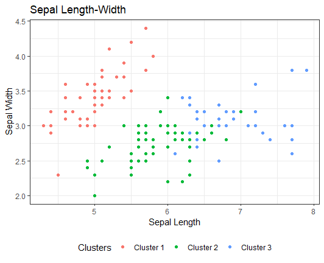

## 1. Cel i zakres projektu
Celem projektu było utworzenie klastrów dla wybranego zbioru danych co najmniej czterema kombinacjami algorytmu z metodą
lub miarą odległości między obiektami. Do realizacji projektu został wybrany zbiór danych nt. populacji Irysa. 
Następnym krokiem było wybranie najlepszej metody klasteryzacji wybranego zbioru danych. Ostatnim krokiem było utworzenie
aplikacji internetowej wykorzystującej najlepszą metodę klasteryzacji do prezentacji sklasteryzowanych danych.

## 2. Opis obszaru tematyki problemu
Tematem projektu jest klasteryzacja zbioru danych, którą należy zrealizować w czterech różnych podejściach
(jedno podejście jest to kombinacja algorytmu z metoda lub miarą odległości). Spośród czterech podejść należy wybrać
najbardziej optymalne podejście i zaimplementować je w aplikacji internetowej, oraz stworzyć interfejs użytkownika 
umożliwiający zmianę danych na osiach przy wizualizacji wyniku.  
Wykorzystywane dane zawierają informację nt. populacji trzech gatunków Irysa. Każdy przypadek składa się z czterech 
atrybutów warunkowych i jednego decyzyjnego. Zbiór zawiera wyłączenie kompletne przypadki, posiadającymi wartości na
wszystkich atrybutach.  
Atrybuty:
  * Sepal length (cm) – długość spodniej części kielicha kwiatu
  * Sepal width (cm) - szerokość spodniej części kielicha kwiatu
  * Petal length (cm) – długość płatka kwiatu
  * Petal width (cm) - szerokość płatka kwiatu
  * Species – gatunek/odmiana kwiatu
  
## 3. Przetestowane algorytmy klasteryzacji
  
Link do pliku zawierającego wszystkie poniższe funkcje: [link](clusteringMethods.R)    

### 3.1 Klasteryzacja z wykorzystaniem algorytmu k-średnich (ang: k-means)
Pierwszą metodą klasteryzacji był algorytm k-średnich (ang: k-means). Aby przeprowadzić klasteryzację, 
konieczne było oddzielenie atrybutów warunkowych od decyzyjnego.  
Utworzono funkcję clustering.kmeans, która za parametr przyjmuje liczbę centroidów. Wewnątrz wywołano metode kmeans, 
której przekazano liczbe centrów i zbiór danych. Z obiektu wynikowego funkcji zwracamy obiekt cluster, 
który zawiera tablicę numerów centroidów, do których przypisany został każdy wiersz.
Następnie do zbioru danych dołączono otrzymane rezulaty oraz wyświetlono wynik w formie wykresu dwuwymiarowego 
(W następnych podpunktach będę pomijał opis tego ostatniego kroku). 

### 3.2 Klasteryzacja z wykorzystaniem algorytmu AGNES i metryki Manhattan
Drugą wykorzystaną metodą klasteryzacji był algorytm AGNES w metryce Manhattan. Jest to algorytm z dziedziny analizy 
skupień, zaliczany do metod aglomeracyjnych, co oznacza, że każda obserwacja początkowo traktowana jest jako osobny
klaster. W kolejnych etapach grupy podobne do siebie łączone są w coraz większe grupy tak długo, aż nie powstanie 
klaster obejmujący wszystkie elementy. Krótko można go także określić algorytmem wstępującym. 

Do implementacji wykorzystano funkcję agnes z pakietu cluster. Przyjmuje ona za parametry zbiór danych, metrykę i metodę.
W tym przypadku wykorzystano metrykę Manhattan i metodę single, tj. określana jest minimalna odległość pomiędzy dwoma 
przykładami należącymi do różnych grup.  
Otrzymany dendogram należy uciąć na odpowiednim poziomie(metoda cutree). W naszym przypadku był to poziom nr. 3. 

### 3.3 Klasteryzacja z wykorzystaniem algorytmu AGNES i metryki Euklidesowej
Sytuacja tożsama z powyższą, różnica występuje jedynie w zastosowanej metryce. Wystarczy zmienić parametr metryki w wywołaniu funkcji.

### 3.4 Klasteryzacja z wykorzystaniem algorytmu DIANA i metryki Manhattan
Jest to algorytm z dziedziny analizy skupień, zaliczany do metod podziału hierarchicznego (przez dzielenie). 
Oznacza to, że początkowo każdy obiekt jest częścią jednego dużego zbioru, który następnie jest dzielony na coraz mniejsze 
zbiory aż do momentu, kiedy każdy element będzie w osobnym zbiorze. Krótko można go także określić algorytmem zstępującym.

Do implementacji wykorzystano funkcję diana z pakietu cluster. Przyjmuje ona za parametry zbiór danych, metrykę i metodę. 
W omawianym przypadku wykorzystano metrykę Manhattan i metodę single, tj. pojedynczego łączenia obiektów, tj. określana 
jest minimalna odległość pomiędzy dwoma przykładami należącymi do różnych grup.
Otrzymany dendogram należy uciąć na odpowiednim poziomie (metoda cutree). W naszym przypadku był to poziom nr. 3. 

### 3.5 Klasteryzacja z wykorzystaniem algorytmu DIANA i metryki Euklidesowej
Sytuacja tożsama z powyższą, różnica występuje jedynie w zastosowanej metryce. Wystarczy zmienić parametr metryki 
w wywołaniu funkcji.

 

## 4. Wybór najefektywniejszego algorytmu.
W wymaganiach do stworzenia aplikacji internetowej było wybranie najbardziej efektywnego algorytmu klasyfikacji. 
W tym celu wykorzystano funkcję silhouette, która odnosi się do metody interpretacji i walidacji spójności w klastrach 
danych. Ta technika zapewnia zwięzłą graficzną reprezentację tego, jak dobrze każdy obiekt został sklasyfikowany.  
Wartość sylwetki jest miarą podobieństwa obiektu do własnego skupienia (kohezji) w porównaniu do innych skupień 
(separacja). Jeśli większość obiektów ma wysoką wartość, konfiguracja klastrowania jest odpowiednia. Jeśli wiele punktów
ma niską lub ujemną wartość, konfiguracja klastrowania może mieć za dużo lub za mało klastrów.  
Aby wyłonić najbardziej optymalną metodę klasteryzacji, dla każdego podejścia wyznaczono wartości współczynnika dla ilości 
klastrów od 2 do 11, z których to wyliczono średnią.  
[link do pliku](Testing.R)

Wykresy poniżej prezentują 10 wartości (liczba centroidów bądź punkt odcięcia) dla każdego podejścia, poniżej których 
znajduje się podsumowująca tabela z wartościami średnimi dla każdego podejścia.  

| K-means   | AGNES Euclidean | AGNES Manhattan | DIANA Euclidean | DIANA Manhattan |
|-----------|-----------------|-----------------|-----------------|-----------------|
| 0.4308162 | 0.3366238       | 0.3402677       | 0.4076423       | 0.3908511       |

Na podstawie średniej wartości silhouette dla każdego przetestowanego podejścia stwierdzono, iż najlepszym podejściem do 
tego zbioru danych jest k-średnich.  
Wyniki klasteryzacji dla wszystkich podejść zamieszczam w pliku [results.xlsx](results.xlsx).  
Przedstawienie graficzne klastrów dla ilości centroidów (punktów odcięcia) równym 3.

## 5. Opis wykorzystania stworzonego serwera w Shiny do klasteryzacji danych.
Server http został stworzony przy pomocy pakietu shiny, który to oferuje łatwą i szybką możliwość implementacji aplikacji i
nternetowej w języku R.

Powyższy zrzut ekranu prezentuje interfejs aplikacji. Znajdują się w nim:
  * Slider – pozwalający wybrać interesującą nas liczbę klastrów
  * Dwa dropdowny – pozwalający przypisać parametry do wybranych osi x/y
  * TabSelect – zawiera trzy karty
    * Comparison plot – zawiera dwa wykresy: z danymi przed klasteryzacją (klasa decyzyjna zaznaczana kolorem i kształtem) 
      oraz po klasteryzacji (numer klastra zaznaczony kolorem)
    * Cluster plot – prezentacja wykresu przedstawiającego poszczególne klastry
    * Table data – prezentacja wszystkich danych w formie tabelki  
    
Po zmienieniu dowolnych wartości w polach w górnej części ekranu, wszelkie dane prezentowane na wykresach bądź w tabeli 
samoistnie się odświeżą. W przypadku wybrania dwóch takich samych kolumn wyświetlony zostanie komunikat o błędzie.

